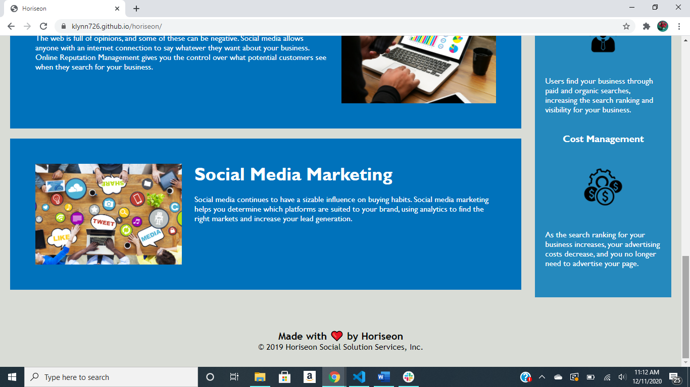

# Code Refactor Starter Code

**Project title: Horiseon**

Description: Given starter code, ensure all links work (functionality), ensure site reflects mock-up given, clean up CSS.

Images:   

Images:    

Github page: [link to Github page](https://klynn726.github.io/horiseon/)

